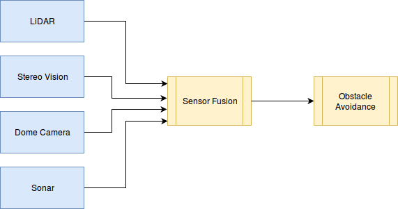

# CPP Husky A200 Avoidance

Review Status: Not Reviewed

## Introduction

This document covers obstacle avoidance specified in [Cal Poly Pomona's Self Driving Husky A200](https://github.com/cpp-self-driving-husky/cpp-husky-a200-design-doc). Obstacle avoidance is a key component for autonomous vehicles and is necessary so that the Husky A200 does not collide with objects in its path. Data will be collected from the sensors on the Husky A200 so that it can autonomously avoid stationary obstacles (e.g. trees, benches, rocks) and moving obstacles (e.g. people, animals, vehicles).

## User Stories

* As a user, I want to avoid all stationary obstacles that would impede transport.
* As a user, I want to avoid all moving obstacles that would impede transport.

## Requirements

* The obstacle avoidance solution shall detect stationary obstacles to avoid.
* The obstacle avoidance solution shall avoid moving obstacles within a certain range (to be determined) and a certain speed limit (to be determined) that would potentially impede transport.
* The obstacle avoidance solution shall avoid obstacles that are sized no larger than to be determined.

## Solution

The present solution for now is to use and modify the Husky A200's existing LiDAR-based obstacle avoidance code and test it through simulation software. As  the project progresses, incorporation of other sensor data (e.g. stereo vision, sonar) can be compiled along with the LiDAR data via sensor fusion. (See design diagram below). This would provide a more accurate data input to sense potential obstacles in the Husky A200's path.

## Data

LiDAR: Sensor that measures the distance from a pulsed laser light to its surroundings.

LiDAR sensor on Husky A200: [SICK LMS151](https://www.sick.com/us/en/detection-and-ranging-solutions/2d-lidar-sensors/lms1xx/lms151-10100/p/p141840)

[ROS Documentation for LMS151](http://wiki.ros.org/LMS1xx)
* Node: LMS100
* Topic: [scan(sensor_msgs/LaserScan)](http://docs.ros.org/api/sensor_msgs/html/msg/LaserScan.html) - contains the LiDAR's data
  * angle_min: start angle of the scan (-2.356 radians = -135 degrees)
  * angle_max: end angle of the scan (+2.356 radians = +135 degrees)
  * angle_increment: angular distance between measurements (0.00872 radians = 0.5 degrees)
  * range_min: minimum range value (0.0099999 meters)
  * range_max: maximum range value (20.0 meters)
  * ranges: distance in meters away an object is based on the time it takes for the light to hit the object and bounce back, used to create a 2D map of surrounding area
  * intensities: strength of reflected light from an object

## Reference

1. [LiDAR-based obstacle avoidance](http://ieeexplore.ieee.org.proxy.library.cpp.edu/document/7279550/?reload=true)
2. [Stereo vision-based obstacle avoidance](http://www.roboken.iit.tsukuba.ac.jp/~ohya/pdf/ISRA2000-MSK.pdf)
3. [Sonar and LiDAR-based obstacle avoidance comparison](http://ceas.uc.edu/content/dam/ceas/documents/UC%20Center%20for%20Robotics%20Research/robpub60.pdf)
